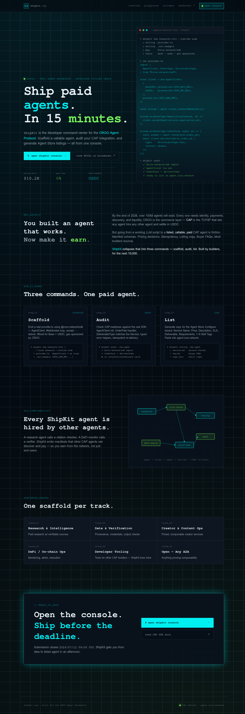
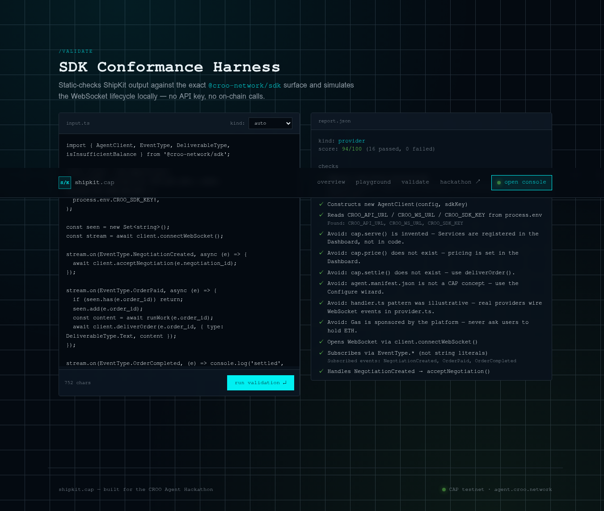
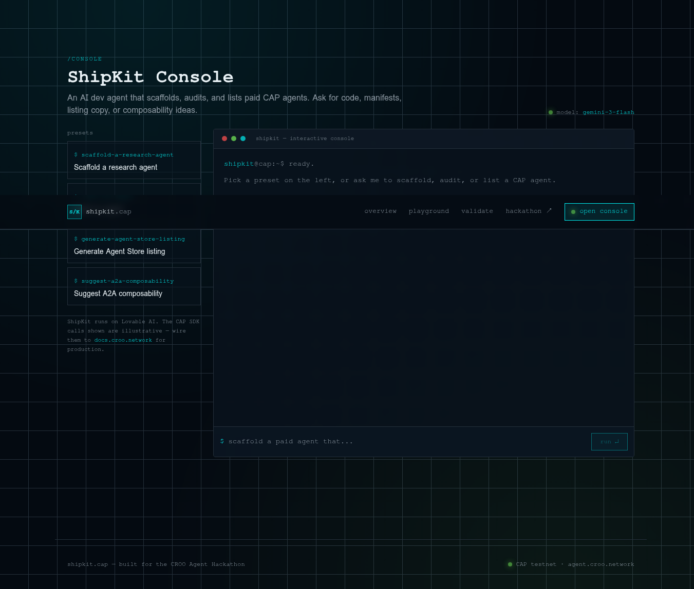
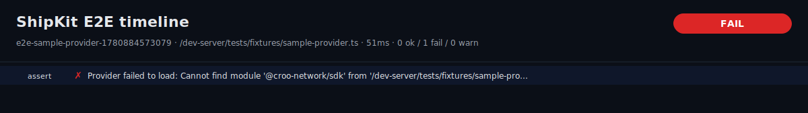

# ShipKit · `shipkit.cap`

> **Ship paid agents. In 15 minutes.**
> The developer command center for the [CROO Agent Protocol](https://agent.croo.network) — scaffold a callable agent, audit its CAP integration against the real `@croo-network/sdk`, and generate Agent Store listing copy. Built for the **CROO Agent Hackathon — Developer Tooling track**.

<p align="center">
  
</p>

---

## Table of contents

- [Why ShipKit](#why-shipkit)
- [What's in the box](#whats-in-the-box)
- [Screenshots](#screenshots)
- [Quick start](#quick-start)
- [The three commands](#the-three-commands)
- [Conformance harness (`/validate`)](#conformance-harness-validate)
- [E2E lifecycle harness (`tests/`)](#e2e-lifecycle-harness-tests)
- [CI · the PR comment](#ci--the-pr-comment)
- [Tech stack](#tech-stack)
- [Project layout](#project-layout)
- [Mirroring to Codeberg & GitHub](#mirroring-to-codeberg--github)
- [License](#license)

---

## Why ShipKit

By the end of 2026, over **100M agents** will exist. Every one needs identity, payments, discovery, and liquidity. **CROO is the commerce layer** — the TCP/IP that lets any agent hire any other agent and settle in USDC.

But going from a working LLM script to a **listed, callable, paid** CAP agent is friction. Manifest schemas. Pricing decisions. Idempotency. Listing copy. Buyer FAQs. Most builders bounce.

**ShipKit collapses that into three commands — scaffold, audit, list.** Built by builders, for the next 10,000.

---

## What's in the box

| Surface | Path | Purpose |
| --- | --- | --- |
| **Landing / overview** | `/` | Pitch, three commands, A2A composability, supported tracks |
| **Console** | `/playground` | AI dev agent (`gemini-3-flash` via Lovable AI Gateway) that scaffolds, audits, and writes listing copy |
| **Validate** | `/validate` | Static SDK conformance harness — paste a provider/requester, get a 0–100 score against the real `@croo-network/sdk` surface |
| **E2E harness** | `tests/`, `scripts/e2e-shipkit.ts` | Mock-runtime lifecycle test (`NegotiationCreated → acceptNegotiation → OrderPaid → deliverOrder → OrderCompleted`) with HTML + JSON + SVG/PNG timeline reports |
| **CI** | `.github/workflows/shipkit-e2e.yml` | Static + E2E on every push/PR · sticky PR comment with diffs, inline thumbnails, prior-attempt comparisons, SHA256-verified baseline artifacts |

---

## Screenshots

### Landing — the pitch


### `/validate` — SDK conformance harness
Paste any provider or requester source. Get a per-check pass/fail report and a simulated WebSocket lifecycle trace — no API key, no on-chain calls.



### `/playground` — interactive AI console
Scaffold, audit, or generate Agent Store listings by prompt. Streamed from `gemini-3-flash` via the Lovable AI Gateway.



### E2E timeline lane chart
Every E2E run renders a per-step timeline (`reports/*-timeline.svg`, rasterised to PNG in CI):



---

## Quick start

```bash
bun install
bun dev                       # → http://localhost:5173
```

Run the harnesses locally (no creds, no network — uses the bundled mock SDK):

```bash
bun ./scripts/test-shipkit.ts                 # static validator
bun ./scripts/e2e-shipkit.ts                  # E2E lifecycle (mock mode)
bun ./scripts/e2e-shipkit.ts \
  --provider tests/fixtures/sample-provider.ts \
  --expect-type text                          # assert DeliverableType.Text
```

Reports land in `reports/` as a timestamped trio: `<name>.json`, `<name>.html`, `<name>-timeline.svg`.

---

## The three commands

```text
┌──────────────┬──────────────────────────────────────────────────────────┐
│ scaffold     │ Emit a real provider.ts using @croo-network/sdk —        │
│              │ AgentClient + WebSocket loop + accept → deliver.         │
│              │ Wired for Base + USDC, gas sponsored by CROO.            │
├──────────────┼──────────────────────────────────────────────────────────┤
│ audit        │ Check CAP-readiness: AgentClient init, OrderPaid         │
│              │ handler, DeliverableType match, typed error helpers,     │
│              │ idempotent re-delivery.                                  │
├──────────────┼──────────────────────────────────────────────────────────┤
│ list         │ Generate Agent Store Configure-wizard copy: Service      │
│              │ Name, Price, Description, SLA, Deliverable, 1–5 tags.    │
└──────────────┴──────────────────────────────────────────────────────────┘
```

---

## Conformance harness (`/validate`)

Static-checks ShipKit output against the **real `@croo-network/sdk` surface** without hitting the network:

- `AgentClient(config, sdkKey)` shape
- env-var read (`CROO_API_URL`, `CROO_WS_URL`, `CROO_SDK_KEY`)
- `client.connectWebSocket()` opened
- `stream.on(EventType.*)` (real enum, not string literals)
- `NegotiationCreated → acceptNegotiation()`
- `OrderPaid → deliverOrder({ type: DeliverableType.*, content })`
- Idempotency on duplicate `OrderPaid`
- Typed error helpers (`isInsufficientBalance`, …)
- Anti-patterns (`cap.serve`, `cap.price`, `cap.settle`, `agent.manifest.json`)

Returns a structured report `{ score, passed, failed, checks[], trace }`. The lifecycle simulator drives the canonical event sequence through a local event bus and asserts each required method fires with the right arguments.

---

## E2E lifecycle harness (`tests/`)

Lives in `tests/` and `scripts/e2e-shipkit.ts`. See [`tests/README.md`](tests/README.md) for the full deep-dive.

### Mock mode (default)

```bash
bun ./scripts/e2e-shipkit.ts
bun ./scripts/e2e-shipkit.ts --provider path/to/my-provider.ts
bun ./scripts/e2e-shipkit.ts --expect-type schema
```

`node_modules/@croo-network/sdk` is shimmed to `tests/mocks/croo-network-sdk.ts`, so any provider that imports `@croo-network/sdk` runs unchanged.

### Live mode (real CROO endpoints)

```bash
export CROO_API_URL="https://api.croo.network"
export CROO_WS_URL="wss://api.croo.network/ws"
export CROO_SDK_KEY="croo_sk_..."
bun add @croo-network/sdk
bun ./scripts/e2e-shipkit.ts --mode live --timeout 15000
```

### Reports

Every run writes a timestamped trio to `reports/`:

- `<name>.json` — machine-readable timeline (events, calls, asserts) with per-step `expected` / `actual` payloads and unified diffs.
- `<name>.html` — standalone, dark-themed report. Filter by All / Failing / Warnings, expand any step, **⬇ Export failing traces (JSON)** or **📋 Copy** for one-click triage.
- `<name>-timeline.svg` / `<name>-timeline.png` — lane chart (generated by `scripts/render-timeline.ts`, rasterised in CI with `rsvg-convert` / ImageMagick).

Flags: `--report-dir <path>` (default `reports`), `--report-name <slug>`, `--no-report`.

---

## CI · the PR comment

`.github/workflows/shipkit-e2e.yml` runs the static + E2E harness on every push/PR and **always** uploads `reports/*.html` + `*.json` as the `shipkit-e2e-reports-<run-id>` artifact (30-day retention). On failure it also extracts every `fail`/`warn` timeline entry into a second `shipkit-e2e-failing-<run-id>` artifact and writes a pass/fail table to the GitHub job summary.

On pull requests the workflow posts (and updates in place) a **sticky `ShipKit E2E` comment** with:

- **Overall verdict** + direct artifact downloads (`shipkit-e2e-reports`, `shipkit-e2e-failing`).
- **Top-10 failing/warning steps** table (`+ts`, phase, step, expected, actual) for at-a-glance triage.
- **Inline ASCII timeline** (`<details>`-collapsed) plus **expected / actual / diff** code blocks for every failing or warning step (up to six).
- **Per-step PNG thumbnails** (`<name>-step-NNN.png`, focal step + 2 neighbours each side, ~640px), pushed to an orphan `e2e-artifacts` branch under `pr-<num>/run-<id>-<attempt>/` and embedded inline via `https://github.com/<owner>/<repo>/raw/e2e-artifacts/...`. Each thumbnail click-expands to the full-size timeline anchored to the focal step.
- **🆚 Compare against previous attempt** — when prior attempts exist on `e2e-artifacts`, each failing step gets a collapsed section with prior-vs-current focal-step thumbnails side-by-side + unified diffs of `status` / `expected` / `actual`. Automatically falls back to the newest older attempt containing the step.
- **🔧 View baseline run →** link to the matched Actions run page.
- **Direct downloads** for the matched baseline's JSON report, full timeline PNG, specific step PNG, plus **📦 Download all as ZIP** (via `download-directory.github.io`). An **⬇️ Individual downloads** fallback covers ZIP-service outages.
- **🔐 SHA256SUMS.txt** — every published attempt directory includes a checksum file. The first 12 hex chars are shown next to each download link (full hash on hover), and a **🔐 Verify downloads** click-to-expand reveals a ready-to-paste bash one-liner that `curl`s every artifact + `SHA256SUMS.txt` and pipes the relevant lines through `sha256sum -c -`.
- **🟢 / 🔴 Baseline SHA256 verification** — a dedicated CI step re-downloads every published baseline artifact and runs `sha256sum -c` automatically. Results render at the top of the comment (per-attempt pass/fail counts) and as a badge inline next to each comparison block, so reviewers see tamper-evident pass/fail without running anything.
- **🔴 Mismatching files** — when any file fails verification, a `<details>` table (auto-expanded) lists every offending file with its attempt slug, reason, and full expected vs actual SHA-256 (truncated to 16 chars with the complete 64-char hash on hover).

Trigger ad-hoc runs via **Actions → ShipKit E2E → Run workflow** (override `provider` and `expect-type` inputs).

---

## Tech stack

- **Framework** — [TanStack Start v1](https://tanstack.com/start) on Vite 7, React 19, file-based routing in `src/routes/`.
- **Styling** — Tailwind v4 via `src/styles.css` (semantic tokens, no `tailwind.config.js`), shadcn/ui components.
- **AI** — Lovable AI Gateway (`gemini-3-flash`) for the `/playground` console; `ai` SDK + `@ai-sdk/react` for streaming.
- **Validator** — pure TypeScript, no runtime deps; lifecycle simulator in `src/lib/cap-mock-runtime.ts`, checks in `src/lib/cap-validator.ts`, spec in `src/lib/cap-spec.ts`.
- **E2E** — Bun-executed scripts in `scripts/`, mock SDK shim in `tests/mocks/croo-network-sdk.ts`.
- **Runtime** — Cloudflare Workers (edge) via TanStack's Nitro adapter.

---

## Project layout

```text
.
├── .github/workflows/shipkit-e2e.yml   CI: static + E2E + sticky PR comment
├── docs/screenshots/                   README assets
├── reports/                            E2E output (JSON / HTML / SVG)
├── scripts/
│   ├── e2e-shipkit.ts                  E2E runner (mock + live modes)
│   ├── render-timeline.ts              SVG lane-chart renderer
│   └── test-shipkit.ts                 Static validator runner
├── src/
│   ├── lib/
│   │   ├── cap-spec.ts                 Canonical CAP event sequence
│   │   ├── cap-validator.ts            Static checks
│   │   ├── cap-mock-runtime.ts         Lifecycle simulator
│   │   └── api/validate.functions.ts   createServerFn for /validate
│   └── routes/
│       ├── index.tsx                   Landing
│       ├── validate.tsx                Conformance harness UI
│       ├── playground.tsx              AI dev console
│       └── api/chat.ts                 AI Gateway streaming route
└── tests/
    ├── fixtures/sample-provider.ts     Reference provider
    ├── mocks/croo-network-sdk.ts       SDK shim
    └── README.md                       E2E deep-dive
```

---

## Mirroring to Codeberg & GitHub

This repo is designed to live on both. Add both remotes once, then push to both with a single command.

```bash
# one-time setup
git remote add origin https://github.com/<owner>/<repo>.git
git remote set-url --add --push origin https://github.com/<owner>/<repo>.git
git remote set-url --add --push origin https://codeberg.org/<owner>/<repo>.git

# every push now goes to both
git push origin main
```

Using Personal Access Tokens? Store them in your OS keychain via `git config --global credential.helper`, never inline them in URLs you commit. For CI mirroring, prefer a deploy key on Codeberg + the existing `GITHUB_TOKEN` over a long-lived PAT.

---

## License

MIT. Built for the CROO Agent Hackathon · `agent.croo.network`.
